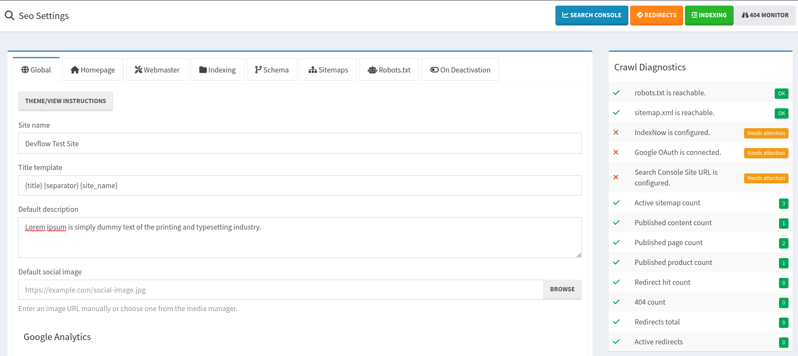
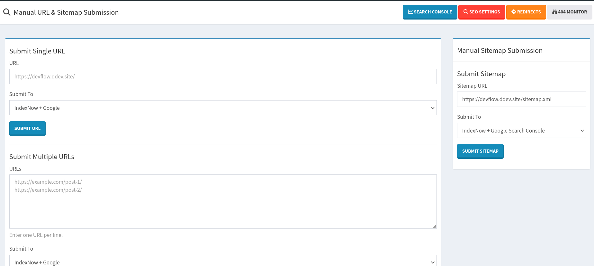
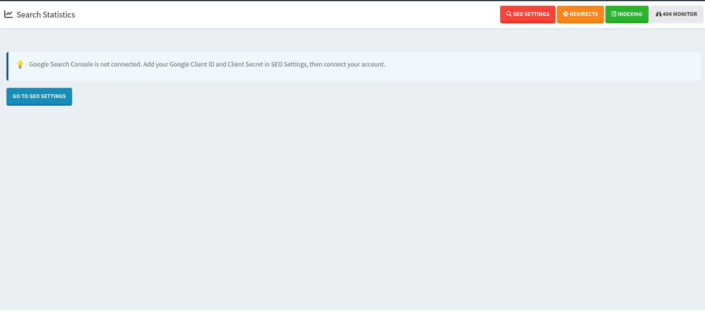
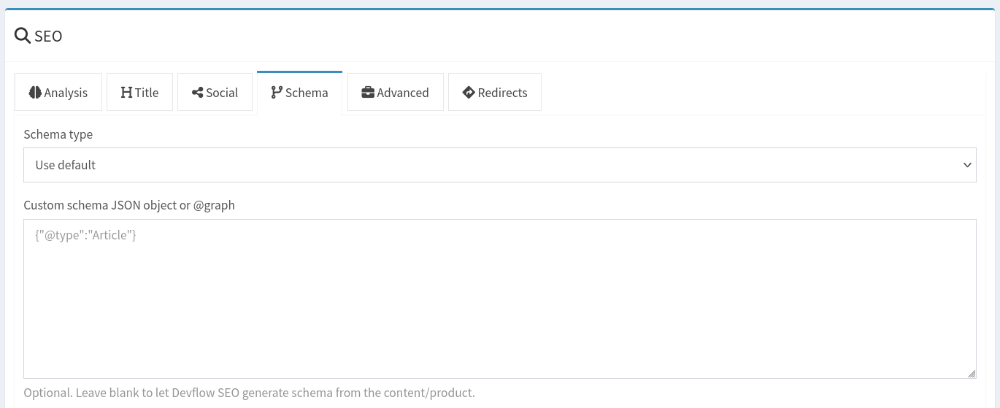
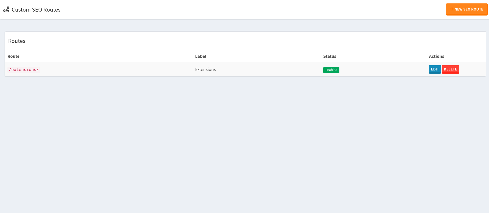
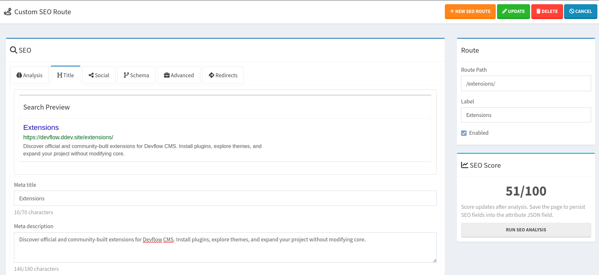

# Simple SEO Plugin

Simple SEO is an SEO management suite for Devflow CMS covering on-page SEO, technical SEO, indexing, crawl management, 
404 monitoring, and so much more. Simple SEO currently uses version 2.1.1 of the 
[melbahja/seo](https://github.com/melbahja/seo/tree/v2.1.1) library.

> __Requires__ Devflow Version: 2.3.2

> __Tested Up To:__ 2.5.0

> __Requires PHP:__ 8.4+

> __Stable Tag:__ 1.2.0

> __License:__ GPLv2-only

## Documentation

Check out the [wiki](../../wiki) documentation on how to configure the plugin and setup your theme or layout.

## Screenshots







## Features

- Meta Tags
- Schema (Structured Data)
- Redirection
- Custom SEO Route
- Global SEO settings
- Homepage SEO settings
- Webmaster verification
- Google Search Console settings and token verification endpoint
- Google Analytics and Google Tag Manager support (Experimental)
- Per-content/product/page SEO tabs: Analysis, Title, Social, Schema, Advanced, Redirects
- Search preview and content analysis
- Open Graph and Twitter/X fields
- Runtime Robots.txt
- 404 Monitoring
- Pre-built schema types and custom JSON-LD field
- Runtime-only sitemap routes, no saved sitemap files:
  - `/sitemap.xml`
  - `/sitemap-content.xml`
  - `/sitemap-products.xml`
  - `/sitemap-news.xml`
  - `/sitemap-images.xml`
  - `/sitemap-videos.xml`
- IndexNow + Google Index Submission (automatic and manual)

## Codex Installation

1. Start a new shell session.
2. Navigate to the root of your install, run the following command ```php codex plugin:install getdevflow/simple-seo```.

## Frontend usage

Make sure your theme or layout is structured with the needed helpers which fires certain actions:

```php
<?php

use App\Application\Devflow;

use function App\Shared\Helpers\cms_body_open;
use function App\Shared\Helpers\cms_footer;
use function App\Shared\Helpers\cms_head;
?>
<!doctype html>
<html lang="<?=Devflow::$PHP->configContainer->string('app.language');?>">
<head>
    <meta charset="<?=Devflow::$PHP->configContainer->string('app.charset');?>">
    <?php cms_head(); ?>
</head>

<body>
    <?php cms_body_open(); ?>

    ...

    <?php cms_footer(); ?>
</body>
</html>
```

## Overrides

If the autogenerated schema is wrong, you can use overrides for Homepage, content, product, or pages.



### Example: Article

```json
{
  "@type": "Article",
  "headline": "Introducing Devflow CMS",
  "description": "A modern content management framework for PHP developers.",
  "author": {
    "@type": "Person",
    "name": "Joshua Parker"
  },
  "datePublished": "2026-06-10T10:00:00-06:00",
  "dateModified": "2026-06-10T10:00:00-06:00"
}
```

### Example: BlogPosting

```json
{
  "@type": "BlogPosting",
  "headline": "6 Advantages of Using Devflow",
  "description": "Why developers are choosing Devflow CMS.",
  "keywords": [
    "devflow",
    "php cms",
    "content management"
  ]
}
```

### Example: Product

```json
{
  "@type": "Product",
  "name": "Devflow CMS Book",
  "description": "Learn Devflow CMS from the ground up.",
  "brand": {
    "@type": "Brand",
    "name": "Devflow"
  },
  "offers": {
    "@type": "Offer",
    "price": "29.99",
    "priceCurrency": "USD",
    "availability": "https://schema.org/InStock"
  }
}
```

### Example: Local Business

```json
{
  "@type": "LocalBusiness",
  "name": "Devflow CMS",
  "telephone": "+1-555-555-5555",
  "address": {
    "@type": "PostalAddress",
    "streetAddress": "123 Main Street",
    "addressLocality": "Colorado Springs",
    "addressRegion": "CO",
    "postalCode": "80903",
    "addressCountry": "US"
  }
}
```

### Example: FAQ Page

```json
{
  "@type": "FAQPage",
  "mainEntity": [
    {
      "@type": "Question",
      "name": "What is Devflow CMS?",
      "acceptedAnswer": {
        "@type": "Answer",
        "text": "Devflow CMS is a developer-focused content management framework."
      }
    },
    
      "acceptedAnswer": {
        "@type": "Answer",
        "text": "Yes, Devflow includes built-in multisite support."
      }
    }
  ]
}
```

## Custom SEO Routes

Custom SEO Routes allow you to define search engine metadata and structured data for routes that are not managed by 
Devflow CMS Pages, Content, Products, or by using a theme.

When a visitor requests a matching route, the defined metadata and schema automatically gets injected into the page.






